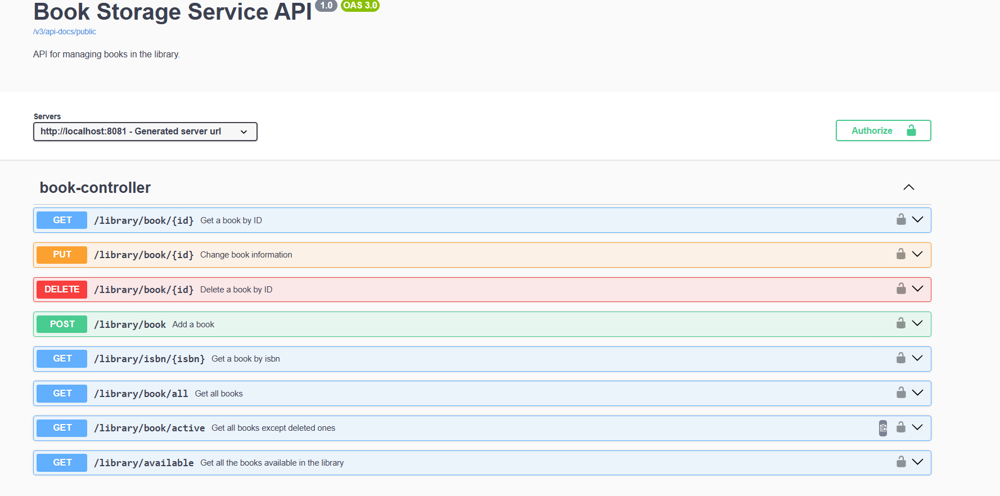
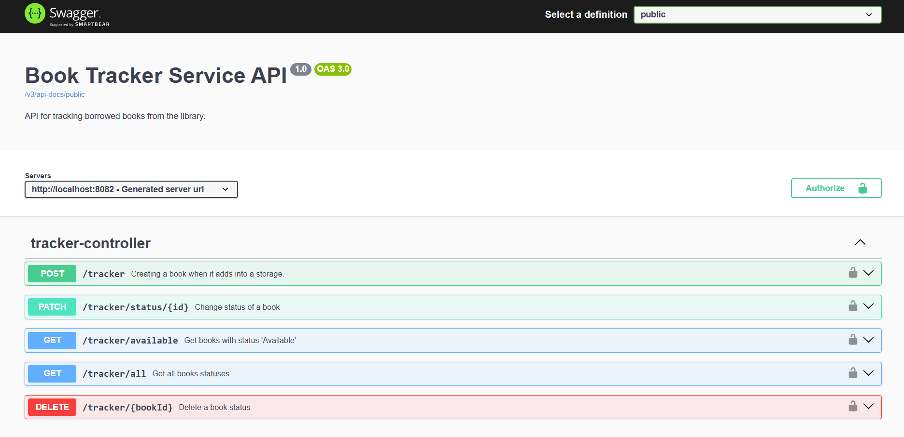

# Book Management System

This project is a book management system consisting of two microservices: `book-storage-service` and `book-tracker-service`. Both services are written in Java and use Maven for dependency management and build automation. Additionally, the project uses Keycloak for authentication and authorization, which is run using Docker.

## Table of Contents
- [Requirements](#requirements)
- [Installation](#installation)
- [Running the Application](#running-the-application)
  - [Running with Docker](#running-with-docker)
  - [Running Services Locally (Optional)](#running-services-locally-optional)
  - [Running Keycloak](#running-keycloak)
- [Testing](#testing)
- [Making Requests](#making-requests)
- [Swagger Documentation](#swagger-documentation)

---

## Requirements

To run this project, you will need:
- **Java Development Kit (JDK)** version 17 or higher
- **Apache Maven** version 3.9+
- **Docker** (for running Keycloak, MySQL, and microservices)
- **Postman** (for testing API endpoints)

---

## Installation

1. Clone the repository:
   ```sh
   git clone https://github.com/gerushenka/Library-API.git
   ```

2. Navigate to the project directory:
   ```sh
   cd Library-API
   ```

3. Build the project (this will create the necessary JAR files for the microservices):
   ```sh
   mvn clean install
   ```

4. Ensure Docker is installed and running on your machine.

---

## Running the Application

### Running with Docker

The entire application can be run using Docker Compose. This includes `book-storage-service`, `book-tracker-service`, MySQL, and Keycloak.

1. Navigate to the root directory of the project:
   ```sh
   cd Library-API
   ```

2. Start all services using Docker Compose:
   ```sh
   docker-compose up --build
   ```

   This command will:
   - Build the Docker images for `book-storage-service` and `book-tracker-service`.
   - Start MySQL for database storage.
   - Start Keycloak for authentication and authorization.

3. After the containers are up, the services will be available at:
   - **Book Storage Service**: `http://localhost:8081`
   - **Book Tracker Service**: `http://localhost:8082`
   - **Keycloak**: `http://localhost:8080`

   > Note: If this is the first time running the application, it may take a few moments for the database and services to initialize.

4. Configure Keycloak:
   - Log in to Keycloak at `http://localhost:8080` using the username `admin` and password `admin`.
   - Create a new realm and import the `realm-config.json` file located in the root directory of the project.

---

### Running Services Locally (Optional)

If you prefer to run the services locally instead of using Docker, follow these steps:

#### Running `book-storage-service`

1. Navigate to the `book-storage-service` directory:
   ```sh
   cd book-storage-service
   ```

2. Run the service:
   ```sh
   java -jar target/book-storage-service-0.0.1-SNAPSHOT.jar
   ```

   The service will be available at `http://localhost:8081`.

#### Running `book-tracker-service`

1. Navigate to the `book-tracker-service` directory:
   ```sh
   cd book-tracker-service
   ```

2. Run the service:
   ```sh
   java -jar target/book-tracker-service-0.0.1-SNAPSHOT.jar
   ```

   The service will be available at `http://localhost:8082`.

> **Note**: When running services locally, ensure that MySQL and Keycloak are properly configured and accessible.

---

### Running Keycloak

Keycloak is included in the Docker Compose setup. However, if you want to run it separately:

1. Navigate to the root directory of the project:
   ```sh
   cd Library-API
   ```

2. Start Keycloak using Docker:
   ```sh
   docker-compose up keycloak
   ```

3. Access Keycloak at `http://localhost:8080`.

4. Log in using the username `admin` and password `admin`.

5. Create a new realm and import the `realm-config.json` file.

---

## Testing

To run unit tests for the microservices(make sure that docker running):

1. In the root directory of the project, execute:
   ```sh
   mvn test
   ```

This will run all tests defined in the project.

---

## Making Requests

To interact with the services, you need to obtain a Bearer token for authentication. Follow these steps:

1. Open Postman.
2. Import the Postman collection provided in the project.
3. Execute the request to obtain a token for either a manager or a user.
4. Copy the `access_token` from the response.
5. Add the token to the `Authorization` header in the format: `Bearer <your-token>`.

---

## Swagger Documentation

Both microservices provide Swagger documentation for their APIs:

- **Book Storage Service Swagger**: [http://localhost:8081/swagger-ui/index.html](http://localhost:8081/swagger-ui/index.html)
- **Book Tracker Service Swagger**: [http://localhost:8082/swagger-ui/index.html](http://localhost:8082/swagger-ui/index.html)

You can explore all available endpoints and test them directly through the Swagger UI.





- For production environments, consider using environment variables or secrets for sensitive information such as database passwords and Keycloak configurations.

---

This README provides a comprehensive guide to setting up, running, and interacting with the Book Management System. If you encounter any issues, feel free to open an issue in the repository.
